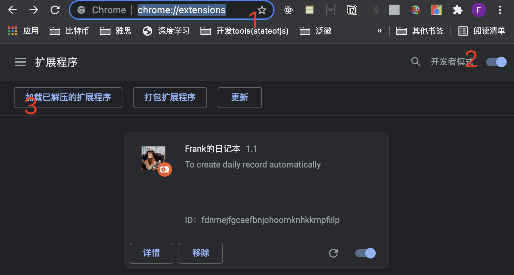
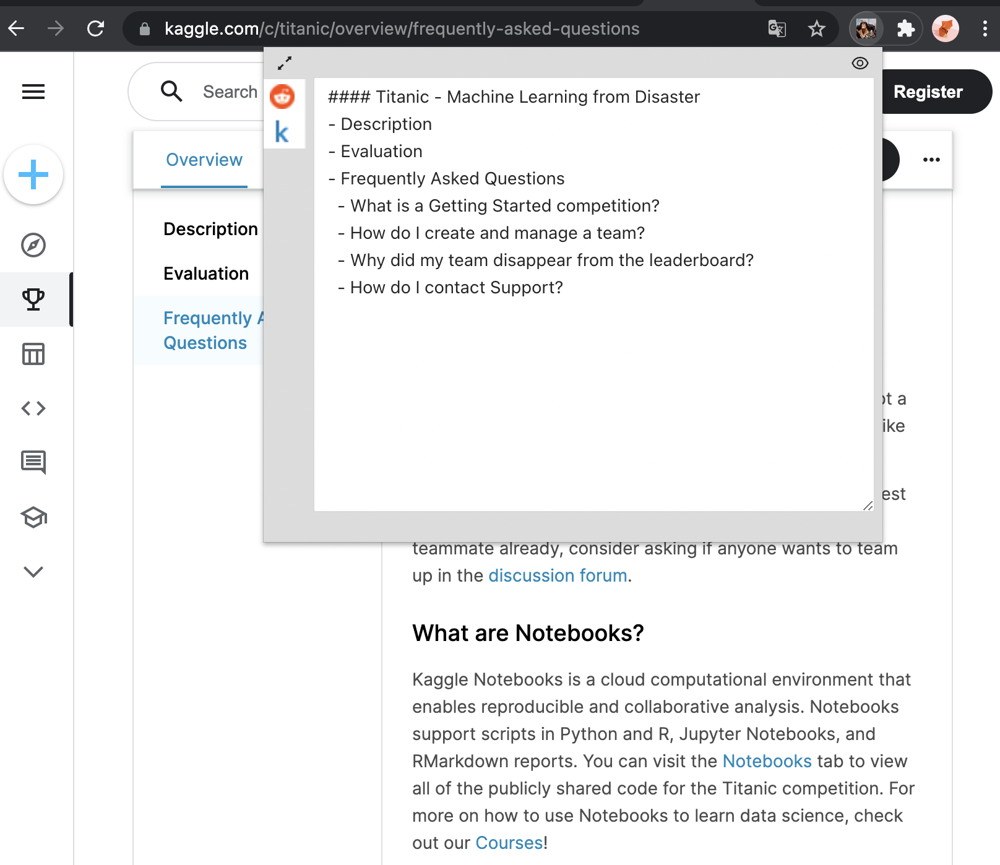
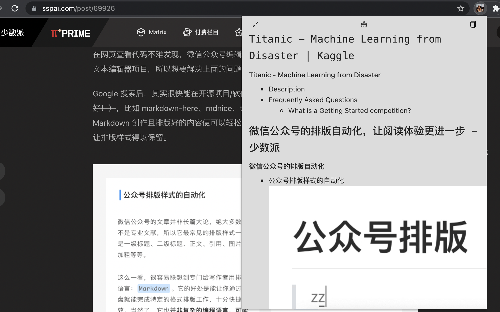

### How to start
- chrome浏览器地址栏，输入chrome://extensions/
- 打开开发者模式
- 点击加载已解压的扩展程序

### Examples
#### Step 1 点击插件，输入一些markdown格式的文本

#### Step 2 点击全部日志预览（左上角）

### Step 3 点击右上角，把markdown拷贝到剪切板

### 👀
### 觉得有用请点个star吧
### 👀